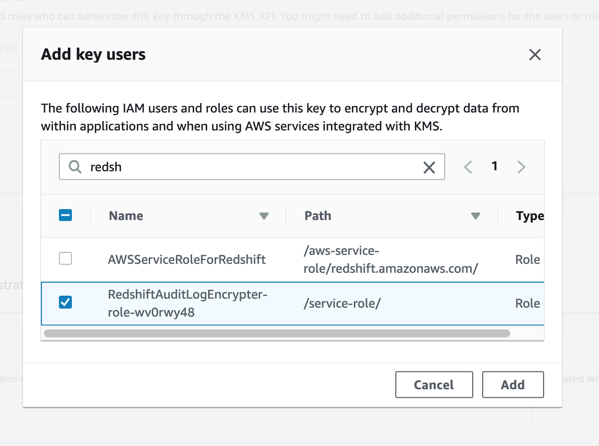
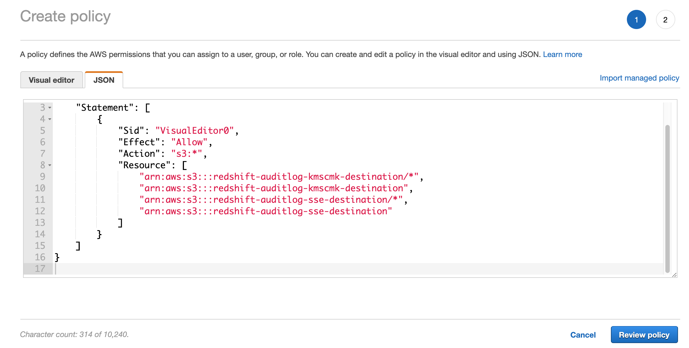
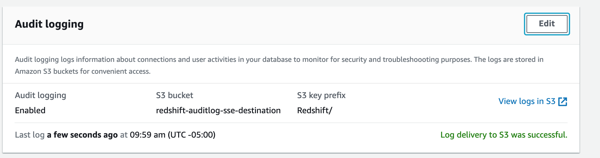

# Redshift Audit Logging - encrypting the log files

This document describes an demonstration of configuring Redshift Audit logging for a final destination of an S3 bucket using KMS Encryption based on Customer Managed Keys.


## Redshift Audit logging
Review details about Redshift Audit logging here: https://docs.aws.amazon.com/redshift/latest/mgmt/db-auditing.html

As of this writing, the documentation states that "Currently, you can only use Amazon S3-managed keys (SSE-S3) encryption (AES-256) for audit logging [to S3]."

In this document, we will show how to use a Lambda function to copy the audit logs into a final location using KMS-CMK encryption.


## Create the KMS Customer Key
Review details about how KMS-CMK encryption for S3 works here: https://docs.aws.amazon.com/AmazonS3/latest/dev/UsingKMSEncryption.html

In this section, we will create a new Customer Managed Key to use for our demonstration.

* Navigate to KMS console

* Click on Customer managed keys

* Click Create Key


* Set the Alias to RedshiftAuditKey


* Click Next

* On the Add Tags step, Click Next

* On the administrators step, define as needed.  Click Next.

* On the Key usage permissions, skip this for now.  We will come back later. Click Next

* Click Finish

* Then click on your new key to go to the detail page and copy the ARN and save it in a notepad for later use:


## Create the S3 bucket for the KMS-CMK destination

In this section, we will create a S3 bucket to use as our final destination.  This is the bucket where we want our Redshift audit log files to be stored with KMS-CMK encryption.


* Navigate to the S3 console

* Click Create Bucket

* Name the bucket: redshift-auditlog-kmscmk-destination

NOTE: You will need to pick a slightly different name as this exact name is likely already taken by me, the author of this document.

* Finish creating your bucket


## Create the S3 bucket for the default SSE destination

In this section, we will create a S3 bucket where Redshift will initially write its audit log files.  We will also turn on default SSE (AES256) encyrption and define a bucket policy that allows Redshift to write to this bucket.

* Navigate to the S3 console

* Click Create Bucket

* Name the bucket: redshift-auditlog-sse-destination

NOTE: You will need to pick a slightly different name as this exact name is likely already taken by me, the author of this document.

* Finish creating your bucket

### Enable default SSE encryption

* Navigate to your new SSE bucket

* Click on Properties tab, then click on Default Encryption


* Change the default encryption for the SS3 bucket to AES256.  Click Save


### Provide a S3 bucket policy that allows Redshift to write audit logs to this bucket

Now we will add a bucket policy to the SSE bucket.  We will be following the instructions here if you want to review them for reference: 
https://docs.aws.amazon.com/redshift/latest/mgmt/db-auditing.html

* Click on the Permission tab for the SSE bucket, then click on Bucket Policy

* Copy/Paste this into the editor:

```
{
	"Version": "2012-10-17",
	"Statement": [
		{
			"Sid": "Put bucket policy needed for audit logging",
			"Effect": "Allow",
			"Principal": {
				"AWS": "arn:aws:iam::RedshiftServiceAccountId:user/logs"
			},
			"Action": "s3:PutObject",
			"Resource": "arn:aws:s3:::BucketName/*"
		},
		{
			"Sid": "Get bucket policy needed for audit logging ",
			"Effect": "Allow",
			"Principal": {
				"AWS": "arn:aws:iam::RedshiftServiceAccountID:user/logs"
			},
			"Action": "s3:GetBucketAcl",
			"Resource": "arn:aws:s3:::BucketName"
		}
	]
}      

```


* Replace RedshiftServiceAccountId with the Redshift Service AccountID for the region where your Redshift Cluster runs as listed on this page: https://docs.aws.amazon.com/redshift/latest/mgmt/db-auditing.html#db-auditing-manage-log-files .  

NOTE: RedshiftServiceAccountId appears twice.  In the below screenshot, I've used the Redshift Service Account ID for the US-EAST-2 Region as that is where my Redshift Cluster will be.


* Replace BucketName with the SSE bucket name.  

NOTE:  BucketName appears twice.


* Click Save


## Create the Redshift Cluster (without auditing for now), if needed

If you do not already have a Redshift Cluster (without auditing enabled), go ahead and create one.  You do not need to specify auditing as you create the cluster.  You will do that after the cluster is created.

* If needed, create a Redshift cluster.  

You can use the defaults for this demonstration.  Be sure the region you use for the Redshift cluster aligns with the region you picked when selecting the Redshift Service Account ID in the SSE bucket policy definition above.


## Create the Lambda function that converts our Audit log files to KMS-CMK encyrption

* Go to the Lambda console

* Click Create Function

* Click Author from Scratch

* Name it: RedshiftAuditLogEncrypter

* For the runtime: pick Python 3.8

* Click Create Function


## Edit the Lambda function to add the source code

* Paste the following code into the code editor (you may need to scroll down the page to see the code editor)

```
import boto3
import os
import sys
import uuid


def lambda_handler(event, context):
    s3 = boto3.client('s3')

    new_bucket = 'redshift-auditlog-kmscmk-destination'
    # edit this with the name of your S3 KMS-CMK bucket to use as the final destination

    new_kms_keyid = 'arn:aws:kms:us-east-2:00000000000:key/95e68752-c84a-4d56-84e4-c9c2f4fe912b'
    # edit this with the ARN of your CMK KMS Key

    for record in event['Records']:
        bucket = record['s3']['bucket']['name']
        key = record['s3']['object']['key']
        key = key.replace("%3A",":")

        print(bucket, key)

        print('Copying/Encrypting ', key)
        copy_source = {'Bucket': bucket, 'Key': key}
            
        s3.copy_object(CopySource=copy_source, Bucket=new_bucket, Key=key, ServerSideEncryption='aws:kms', SSEKMSKeyId=new_kms_keyid)

        print('Done copying/encrypting ', key)


```

* Be sure to make the 2 edits as called out in the comments in the code, substituting your S3 KMS-CMK bucket name and the CMK KMS Key ARN.


* Click Save

## Change the timeout for your Lambda function

* Scroll down the page to the Basic Settings area and change the timeout to 2 minutes.  Scroll back to the top and click Save


## Add the S3 trigger for your Lambda function

* Click the Add Trigger button in the Lambda designer section

* Search/Select for S3 in the drop down.

* For the bucket drop-down, pick your SSE bucket (not your KMS-CMK bucket)

* For the event type, choose "All object create events" (which is the default)

* Leave the rest at their defaults

* Click Add


## Authorize the Lambda function to use your key

* Navigate to KMS Console

* Click on your Customer Managed Key to go to its detail page.

* Scroll down to the Key Users section and click Add

* Search for redshift and select the RedshiftAuditLogEncrypter role.  Click Add.



## Authorize the Lambda function to use your S3 buckets

* Navigate to the IAM Console

* Click on Roles

* Search for Redshift and click on the RedshiftAuditLogEncrypter-role


* Click on Add inline policy

* Click on JSON

* Copy/Paste this into the editor

```
{
    "Version": "2012-10-17",
    "Statement": [
        {
            "Sid": "VisualEditor0",
            "Effect": "Allow",
            "Action": "s3:*",
            "Resource": [
                "arn:aws:s3:::redshift-auditlog-kmscmk-destination/*",
                "arn:aws:s3:::redshift-auditlog-kmscmk-destination",
                "arn:aws:s3:::redshift-auditlog-sse-destination/*",
                "arn:aws:s3:::redshift-auditlog-sse-destination"
            ]
        }
    ]
}

```

* Edit the JSON to match your two S3 bucket names.  You will need to make 4 changes, 2 for each bucket.



* Click Review Policy

* Enter a policy name like: RedshiftAuditS3LambdaPolicy

* Click Create Policy


## Enable Auditing for Redshift

In this section, we will enable auditing for Redshift.


* Navigate to the Redshift console.  The screenshots/directions are based on the new Redshift Console UI.

* Click on Clusters on the left

* Click on the Redshift cluster for which you want to enable auditing

* Click on the Maintenance and Monitoring tab

* Scroll down the page to the Audit logging section and click Edit


* Set enable audit logging to Yes.

* Use an existing S3 bucket

* Select your SSE bucket (not your KMS-CMK bucket)

* Pick a prefix like "Redshift"

* Click Confirm


After auditing is enabled, your cluster detail page should now look like:



Note: It can take approximately 60-90 minutes for log files to start to appear. At first, Redshift will copy over older log files and will catch up to the newer log files over the course of the first day. Aftet that, log files are typically added approximately every 60 minutes, but sometimes can take slightly longer.  The most recent time log files were copied to S3 is shown on the bottom line of the Audit logging section.


## View S3 buckets to confirm things are working

Note: if you just enabled auditing on Redshift, it might take a few hours for the first set of log files to appear.  There should be a test file, however, that is created immediately.


* From the auditing section of the Redshift cluster detail page, click on View logs in S3 link.  This will take you to the S3 console for your SSE bucket.


* Click on the Redshift prefix, navigate through the folder/prefix hierarchy, then finally click the checkbox infront of one of the log files.  You should see that the Encryption here is SSE.


* Now do the same kind of navigation for the S3 KMS-CMK bucket and you will see those files are AWS-KMS encrypted:


* In addition, you can click on the file name to go to the detail page for the file, then the Properties tab, then Encryption to see the Encryption type and the actual KMS key used:


## View the Lambda function Cloudwatch logs

In some scenarios, you might want to be able to view the execution logs of the Lambda function.  This section shows you how to do that.

* Navigate to the Cloudwatch console

* Click on Log Groups on the left-hand column

* Filter for "Redshift" and click on the /aws/lambda/RedshiftAuditLogEncrypter log group


* Click on the most recent log file and you can see the logs for the latest executions:


As currently written, the Lambda code writes out a "Copying/Encrypting [filename]" message, followed by a "Done copying/encrypting [filename]" message which you can see in the above screenshot.  You, of course, can change the Lambda code to work differently if desired.

# Congratulations - You have setup Auditing to a S3 KMS-CMK encrypted final destination

For ideas on what to do with your Redshift auditlogs, you can query them with Redshift Spectrum!  See https://aws.amazon.com/blogs/big-data/analyze-database-audit-logs-for-security-and-compliance-using-amazon-redshift-spectrum/


## Credits

The Lambda code in this example is inspired by https://joshua-hull.github.io/aws/python/2017/05/05/lambda-function-and-encrypted-s3.html

